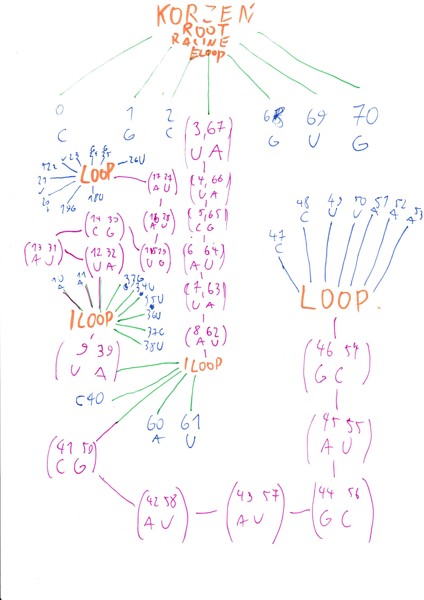

# Atelier

archive/dump of ( *hand-drawn, keyboard-typed, gathered* ) resources created during prototyping
and general pondering.

## content highlights

### mesmerizing tree schema
despite its dubious quality, questionable space allocation and
other flaws. This schema was so useful to me I'd like it
to have the *spotlight* but if just for few fleeting commits;

